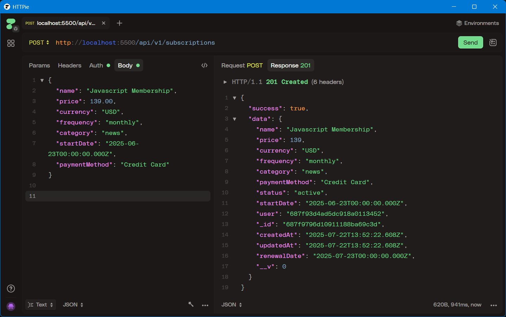
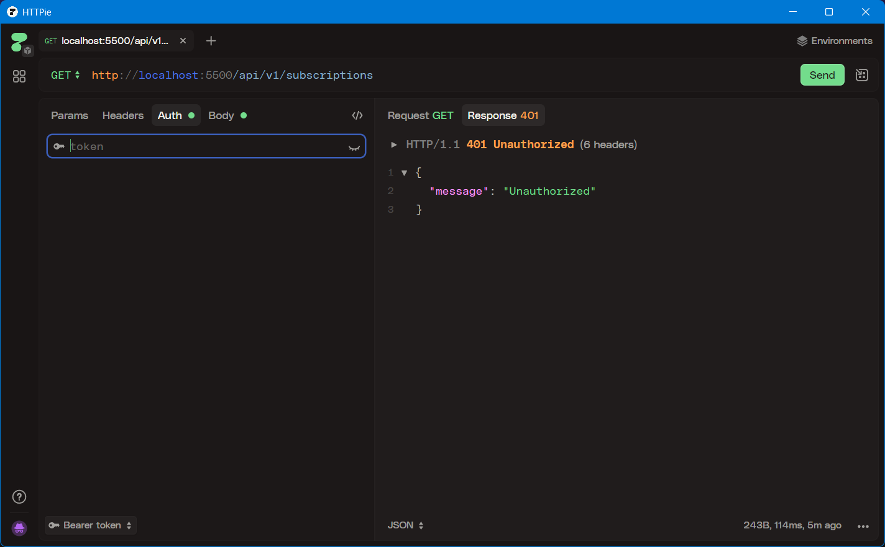
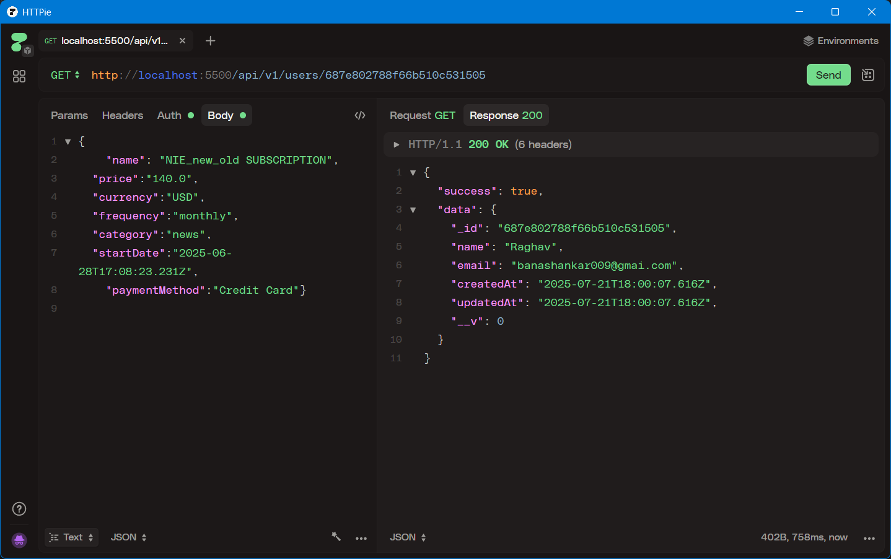

# SubDub – Subscription Tracker API 💸

SubDub is a RESTful API built with Node.js and Express.js for tracking recurring subscriptions. It supports full user authentication, MongoDB storage, automated renewal date calculation, and email reminders. Ideal for managing SaaS, entertainment, or utility subscriptions.

---

## 📌 Features

- 🔐 JWT-based user registration/login
- 💳 Create, update, delete subscriptions
- 📅 Auto-renewal date tracking using frequency
- ✉️ Email notifications via Nodemailer
- 🛡 Request inspection via Arcjet
- ⚙️ Workflow automation using Upstash
- 📂 Modular, scalable architecture

---

## 🗂️ Project Structure

```text
banashankar-tatalagera-subscription-tracker/
├── app.js                     ── Entry point
├── eslint.config.js           ── Linting config
├── package.json
├── README.md
├── config/
│   ├── arcjet.js
│   ├── env.js
│   ├── nodemailer.js
│   └── upstash.js
├── controllers/
│   ├── auth.controllers.js
│   ├── subscription.controller.js
│   ├── user.controller.js
│   └── workflow.controller.js
├── database/
│   └── mongodb.js
├── middlewares/
│   ├── arcjet.middleware.js
│   ├── auth.middleware.js
│   └── error.middleware.js
├── models/
│   ├── subscription.model.js
│   └── user.model.js
├── routes/
│   ├── auth.routes.js
│   ├── subscription.routes.js
│   ├── user.router.js
│   └── workflow.routes.js
├── utils/
│   ├── email-template.js
│   └── send-email.js
└── screenshots/
    ├── subscription_create.png
    ├── subscription_fetch.png
    └── unauthorized.png


```


-----
🧰 Tech Stack

    Node.js + Express – Core API framework

    MongoDB + Mongoose – Database layer

    JWT + bcryptjs – Secure authentication

    Day.js – Date handling & renewals

    Nodemailer – Email delivery

    Arcjet – Request inspection

    Upstash – Workflows & queues

------------

⚙️ Installation

```bash
git clone https://github.com/Banashankar-Tatalagera/subscription-tracker.git
cd subscription-tracker
npm install
```

-----


🔐 Environment Setup

Create a .env file in the root:

```
PORT=5500
MONGO_URI=mongodb://localhost:27017/subdub
JWT_SECRET=your_jwt_secret
EMAIL_USER=youremail@example.com
EMAIL_PASS=yourpassword
```


▶️ **Running the Server**

_Start in Development:_

```bash
npm run dev
```
---
---
_Start in Production:_

```bash
npm start
```
---


🔒 Authentication

All protected routes require a Bearer token.

Auth Routes:


```bash
POST /api/v1/auth/sign-up     # User registration
POST /api/v1/auth/sign-in     # User login
POST /api/v1/auth/sign-out    # User logout (client discards token)
```

---------

Header Format:

Authorization: Bearer <your_token>

📡 **API Endpoints**
---
➕ Create Subscription

```POST /api/v1/subscriptions```
---
```text
Request Body:

{
  "name": "Javascript Membership",
  "price": 139.00,
  "currency": "USD",
  "frequency": "monthly",
  "category": "news",
  "startDate": "2025-06-23T00:00:00.000Z",
  "paymentMethod": "Credit Card"
}
```
----
Sample Response:

{
  "success": true,
  "data": {
    "name": "Javascript Membership",
    "status": "active",
    "renewalDate": "2025-07-23T00:00:00.000Z"
  }
}
----

👤 **Get User Info**
```text
GET /api/v1/users/:userId
```
🚫 **Unauthorized Access Example**
When no token is provided:
```text
{
  "message": "Unauthorized"
}
```

---------------
🧪 **Linting**

npx eslint .
Uses ESLint 9 and @eslint/js config.

-------


## 📸 Screenshots

### ➕ Subscription Creation


### 🔐 Unauthorized Access


### 📥 Subscription Fetch



